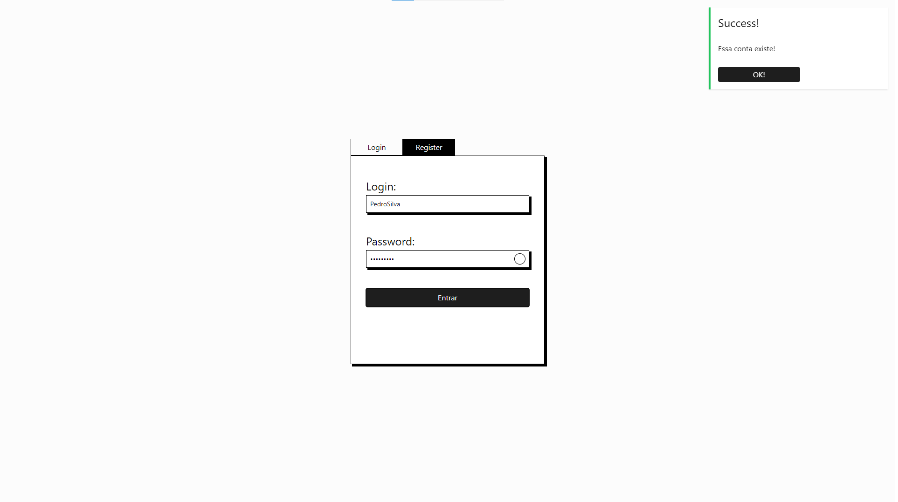
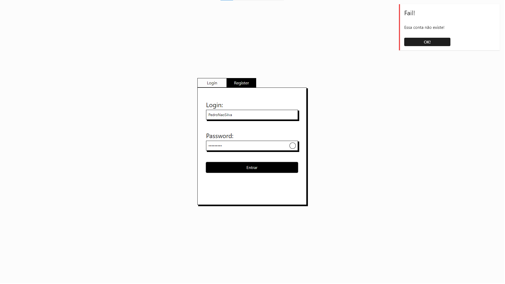
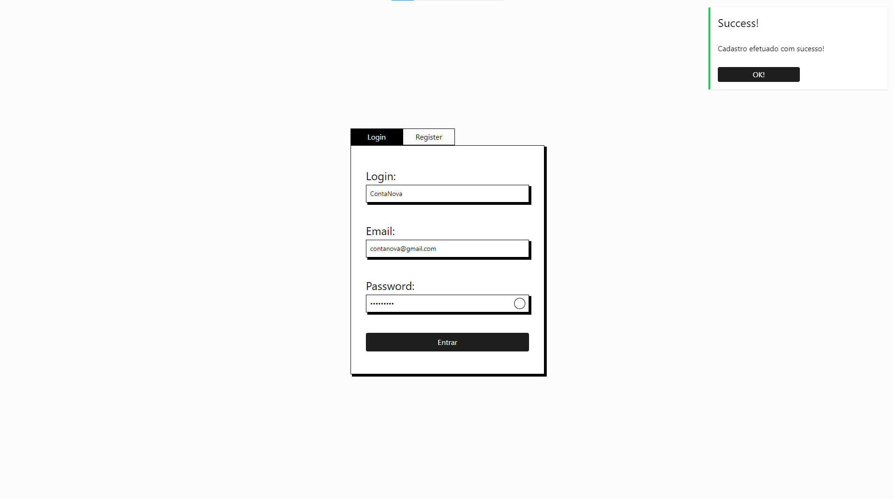

# React + PHP

##### Esse projeto consiste na criação de uma tela de login e cadastro em REACT + Tailwind CSS que consome uma api feita em PHP e retorna valores.

O que foi utilizado:

- Neovim
- Visual Studio Code
- ReactJS
- TailwindCSS
- PHP
- MySQL
- Vite
