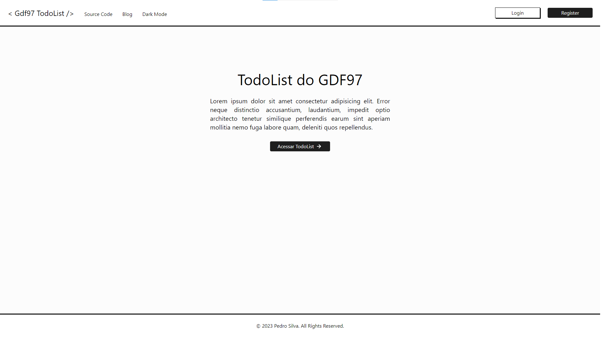
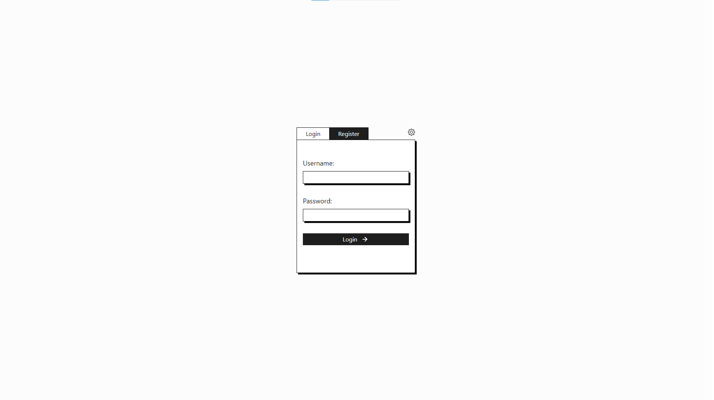
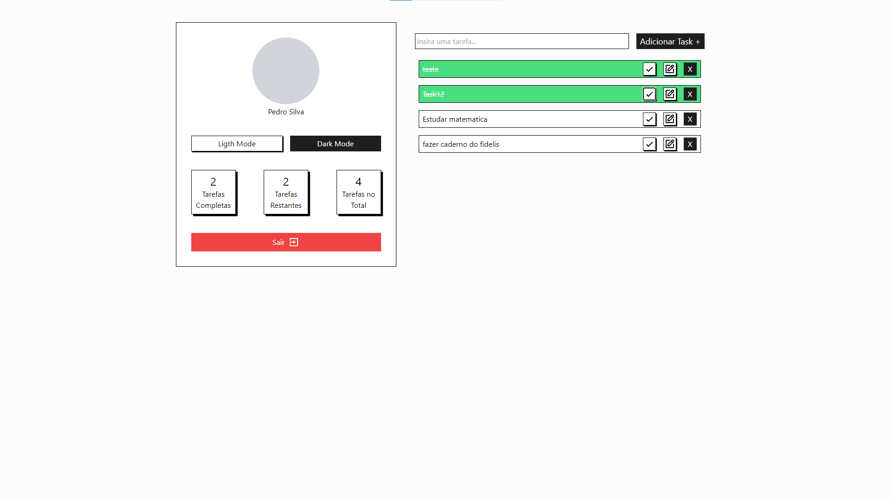
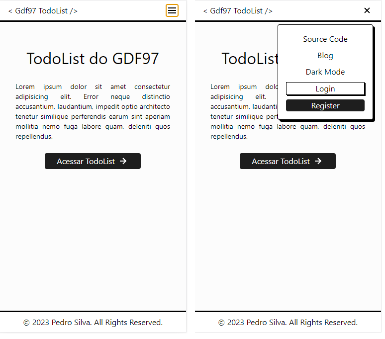
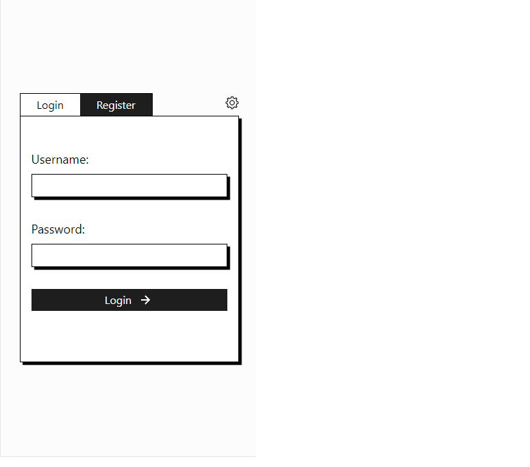
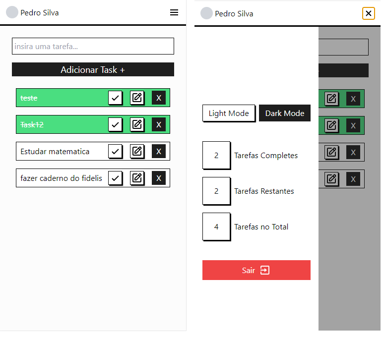

# Real Aplication Todo List

#### Esse projeto consiste na criação de uma "Aplicação real" onde o usuario pode logar em sua conta e com isso conseguir acessar os seus dados, porém falta muita coisa ainda

- Todo

  - [ ] Sofisticar a Autenticação (Utilizar JWT)
  - [ ] Arrumar a estruturação do projeto
  - [ ] Melhorar a nomenclatura
  - Adicionar recursos visuais

    - [ ] Adicionar uma notificação quando o usuário se cadastrar
    - [ ] Adicionar uma notificação quando o usuário acrescentar uma nova tarefa
    - [ ] Adicionar uma animação de loader antes de iniciar a aplicação

##

- Coisas que já estão presentes no projeto:

  - Responsividade
  - Conexão com o banco de dados
  - Suporte para Dark Mode

##

- Ferramentas e Tecnologias Utilizadas
  - NeoVim
  - Vscode
  - Vite
  - Javascript (React)
  - Apache
  - PHP
  - MySQL

##

#### Imagens do Projeto

(Desktop)

#####

(Mobile)

